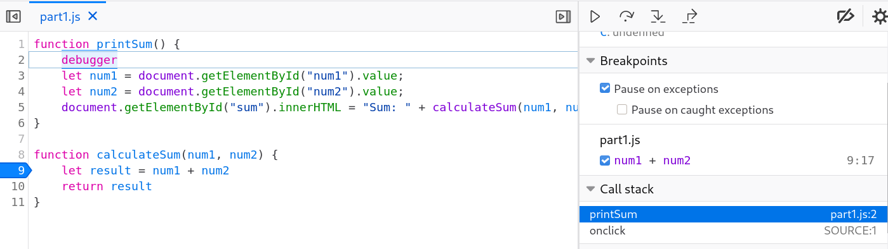
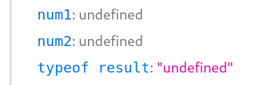
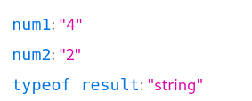
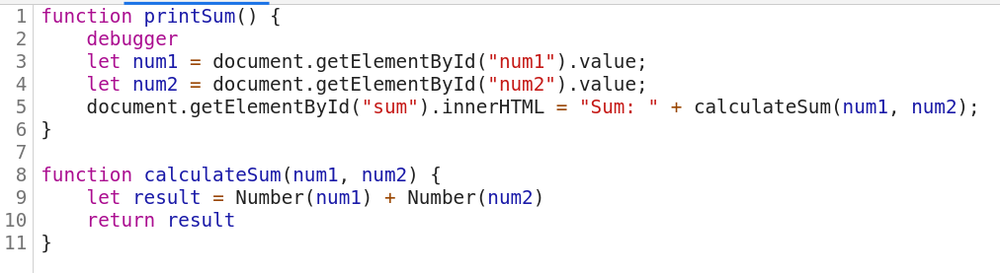

 

1. both `num1` and `num2` are strings, so result is assigned to `num1` concatenated with `num2`
2. Convert both arguments to `Number`
    
3. citylog.json
4. part2.js
5. 11.7 MB
6. 635 ms
7. `Mozilla/5.0 (X11; Linux x86_64) AppleWebKit/537.36 (KHTML, like Gecko) Chrome/90.0.4430.85 Safari/537.36`
8. Apache
9. Tue, 26 Jan 2021 22:14:13 GMT
10. `fetchData()`